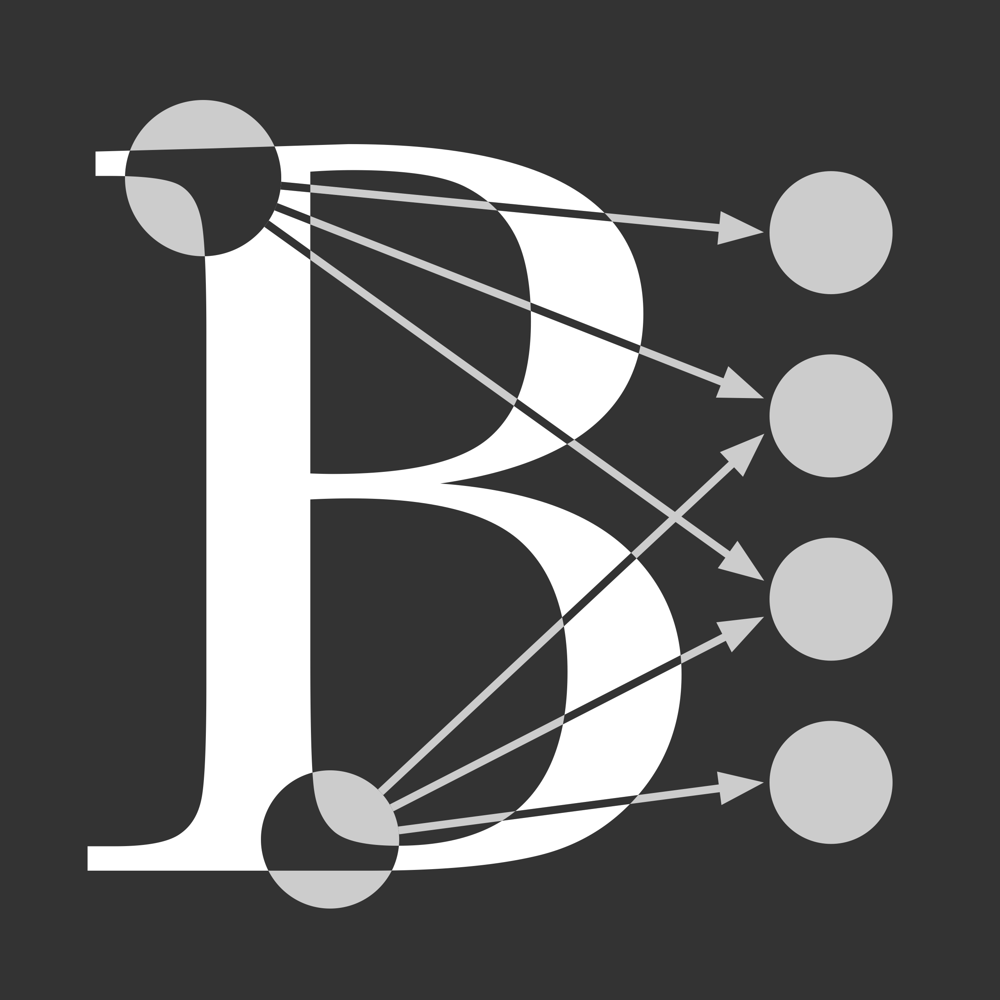
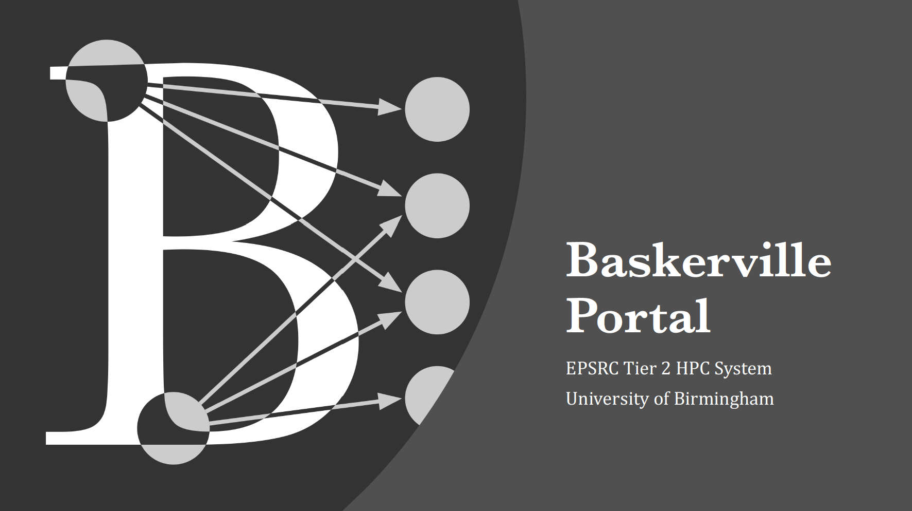

<!-- PROJECT SHIELDS -->
[![Contributors][contributors-shield]][contributors-url]
[![Forks][forks-shield]][forks-url]
[![Stargazers][stars-shield]][stars-url]
[![Issues][issues-shield]][issues-url]
[![License][license-shield]][license-url]

<!-- PROJECT LOGO -->
 

  

<h3 align="center">Baskerville Portal</h3>

  

    Training resources introducing Baskerville Portal for beginners, which provides web-based access to Baskerville services and GUI applications such as JupyterLab.
     
  

<!-- ABOUT THE PROJECT -->
## About The Project

Training resources for an introduction to Baskerville Portal for beginners. This covers:

1. What is Baskerville Portal?
2. Connect and Configure Baskerville Portal
3. JupterLab
     - a. Module Loading
     - b. Conda Environments
4. Final Task: Build PyTorch in a Conda Environment

(<a href="#readme-top">back to top</a>)

<!-- GETTING STARTED -->
## Getting Started

To take this course, you will need a registered account on Baskerville. Details for requesting access can be found [here](https://docs.baskerville.ac.uk/request-access/).

### Prerequisites

This course is for complete beginners, however some familiarity with the following may be beneficial:

- Bash shell
- Python

(<a href="#readme-top">back to top</a>)

<!-- CONTRIBUTING -->
## Contributing

Contributions are what make the open source community such an amazing place to learn, inspire, and create. Any contributions you make are **greatly appreciated**.

If you have a suggestion that would make this better, please fork the repo and create a pull request. You can also simply open an issue with the tag "enhancement".
Don't forget to give the project a star! Thanks again!

1. Fork the Project
2. Create your Feature Branch (`git checkout -b feature/AmazingFeature`)
3. Commit your Changes (`git commit -m 'Add some AmazingFeature'`)
4. Push to the Branch (`git push origin feature/AmazingFeature`)
5. Open a Pull Request

Images of code snippets were generated using [Carbon](https://carbon.now.sh/), and a configuration file, `carbon-config.json`, is provided.

(<a href="#readme-top">back to top</a>)

<!-- LICENSE -->
## License

This work is licensed under a GNU General Public License v3.0. See `LICENSE.md` for more information.

(<a href="#readme-top">back to top</a>)

<!-- CONTACT -->
## Contact

Email us: baskerville-tier2-support@contacts.bham.ac.uk

Project Link: [https://github.com/baskerville-hpc/baskerville-portal](https://github.com/baskerville-hpc/baskerville-portal)

(<a href="#readme-top">back to top</a>)

<!-- ACKNOWLEDGMENTS -->
## Acknowledgments

* [Jenny Wong](https://github.com/jnywong)
* [James Allsopp](https://github.com/JamesAllsopp)
* [Baskerville](https://github.com/baskerville-hpc)
* [BEAR Research Software Group](https://github.com/bear-rsg)

Baskerville is funded by the EPSRC and UKRI through the World Class Labs scheme (EP/T022221/1) and the Digital Research Infrastructure programme (EP/W032244/1).

(<a href="#readme-top">back to top</a>)

<!-- MARKDOWN LINKS & IMAGES -->
<!-- https://www.markdownguide.org/basic-syntax/#reference-style-links -->
[contributors-shield]: https://img.shields.io/github/contributors/baskerville-hpc/baskerville-portal.svg?style=for-the-badge
[contributors-url]: https://github.com/baskerville-hpc/baskerville-portal/graphs/contributors
[forks-shield]: https://img.shields.io/github/forks/baskerville-hpc/baskerville-portal.svg?style=for-the-badge
[forks-url]: https://github.com/baskerville-hpc/baskerville-portal/network/members
[stars-shield]: https://img.shields.io/github/stars/baskerville-hpc/baskerville-portal.svg?style=for-the-badge
[stars-url]: https://github.com/baskerville-hpc/baskerville-portal/stargazers
[issues-shield]: https://img.shields.io/github/issues/baskerville-hpc/baskerville-portal.svg?style=for-the-badge
[issues-url]: https://github.com/baskerville-hpc/baskerville-portal/issues
[license-shield]: https://img.shields.io/github/license/baskerville-hpc/baskerville-portal.svg?style=for-the-badge
[license-url]: https://github.com/baskerville-hpc/baskerville-portal/blob/main/LICENSE.md
